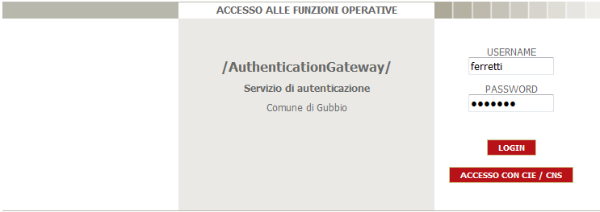
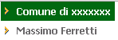
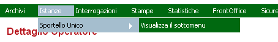
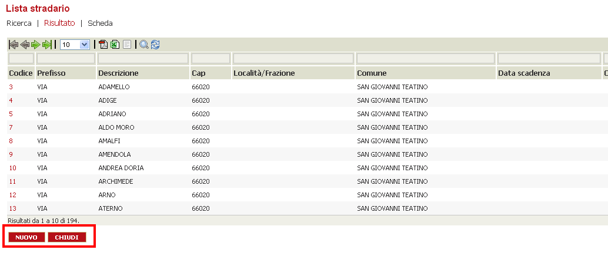
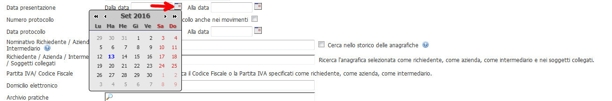
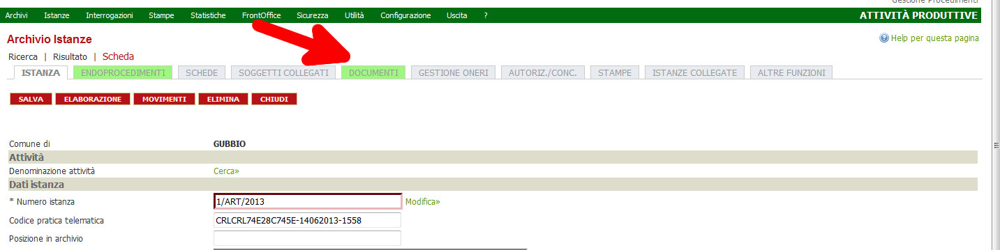
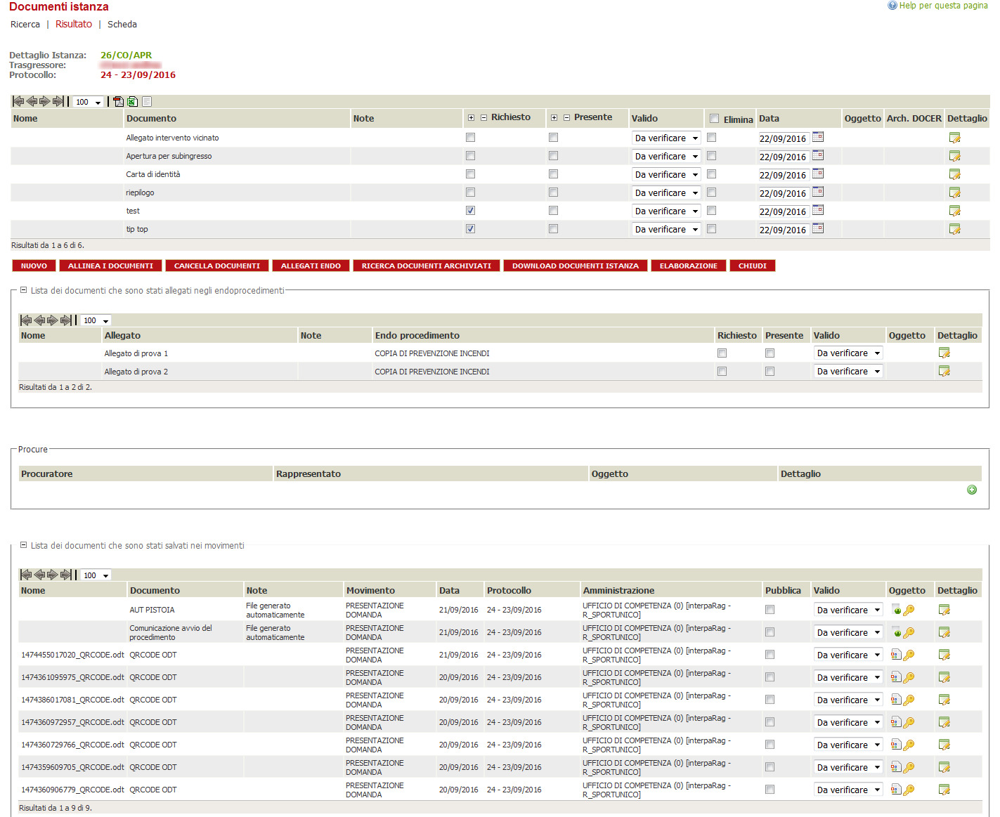
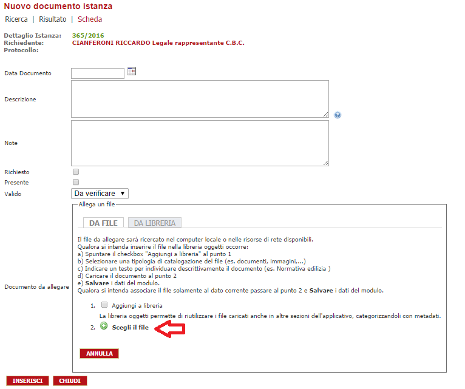
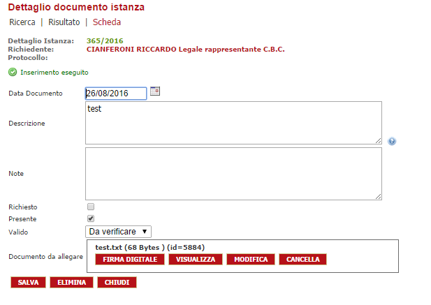
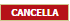

# Funzionalità di base

L’applicativo presenta alcune funzionalità standard, dettagliate in questo paragrafo, che verranno date per scontate nel proseguo del manuale.

## Login {#login}

Arrivati alla pagina di Login del portale, ci troveremo difronte ad una pagina come la seguente:l’ accesso è possibile sia tramite USERNAME e PASSWORD sia tramite CIE \/ CNS, dipende dalla configurazione richiesta.

## Menu e toolbar {#Menu e toolbar}

Nella parte alta dello schermo sono sempre presenti:

* La descrizione dell’ente di appartenenza e il nome e cognome dell’utente autenticato

* Il menu per l’accesso alle funzionalità dell’applicativo, il cui contenuto dipende dal profilo dell’operatore autenticato

Per navigare all’interno del menu è sufficiente passare con il cursore del mouse sopra una qualunque voce che automaticamente mostrerà le voci sottostanti:

Se una voce di menu ha, alla propria destra una freccia \(\) significa che la stessa presenta delle sotto voci esplorabili passando il cursore del mouse sopra la scritta “Visualizza sottomenu”.

Le voci di menu selezionabili per accedere ad una funzionalità dell’applicativo sono quelle che non presentano la freccia sulla destra: è sufficiente effettuare un click con il tasto sinistro del mouse per aprire la funzionalità.

NB: per navigare attraverso le varie voci del menu è preferibile passarci sopra con il cursore del mouse senza effettuare click. In alcuni browser la selezione tramite il pulsante sinistro del mouse può causare problemi nell’apertura della sezione: se ciò dovesse accadere è sufficiente effettuare una selezione differente e riprovare.

## pulsantiera {#pulsantiera}

Quando dal menu viene attivata una funzionalità, nella parte bassa dello schermo sono sempre presenti una serie di pulsanti rossi, come mostrato in figura:

I pulsanti presenti possono variare al variare della funzionalità, di seguito, verranno dettagliati quelli standard::chiude la pagina e rimanda a quella precedentemente utilizzata

:permette accedere alla scheda per l’inserimento di un nuovo record

:permette di inserire un nuovo record

:permette di salvare le modifiche apportate ad un record

:permette di eliminare un record

## Tabelle {#tabelle}

Accedendo ad una qualunque funzionalità dell’applicativo \(tranne quella di gestione delle istanze che verrà dettagliata separatamente\) viene mostrata una tabella con la visualizzazione dei record presenti. Per maggiore chiarezza concentriamo l’esempio su una funzionalità specifica \(lo stradario\) in modo da vedere le possibili operazioni effettuabili: quanto descritto può essere semplicemente esteso a qualunque altra funzionalità.

### 

## Campi di input referenziati {#campi di input referenziati}

Si tratta di un tipo dato che ha, come caratteristica quella di proporre i record del DB che contengono la sequenza dati digitata

## Campi di input di tipo data {#campi di input di tipo data}

Dove compare l’ icona calendario \(come evidenziato dalla freccia nell’ immagine sottostante\)tramite il click sopra di esso, sarà possibile visualizzare un calendario che propone di default il giorno corrente, ma è modificabile a piacimento per poter selezionare la data voluta.

## Upload di un file {#upload di un file}

All’ interno di una Istanza, posizionandosi sul tab DOCUMENTI verrà visualizzata la seguente paginain questa tabella, sono visibile tutti i documenti presenti la loro posizione all’ interno all’ interno della Istanza \(endoprocedimenti, movimenti\)Cliccando il pulsante “Nuovo” è possibile inserire un nuovo file. Nella descrizione è possibile inserire il nome del documentoSu documento da allegare “Allega un file”, selezionando **scegli file** è possibile determinare il documento desiderato. Cliccando su “inserisci” viene caricato il documento.

Per modificare un documento: Aprire sul icona dettaglio

: Attiva l’applicativo per effettuare la firma digitale.

: Visualizza il file caricato

:Modifica del file selezionato

:Cancella il documento allegato

