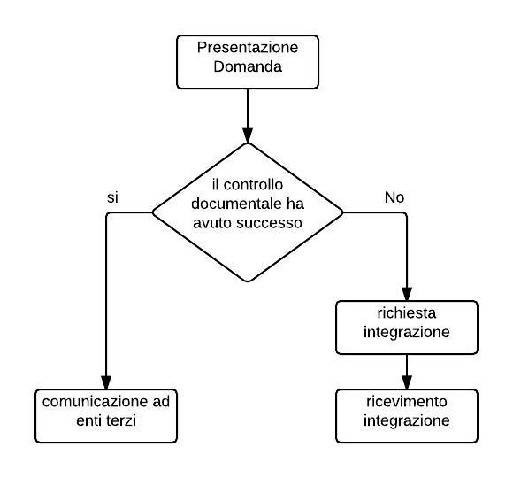
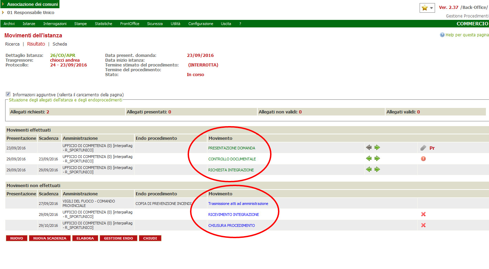
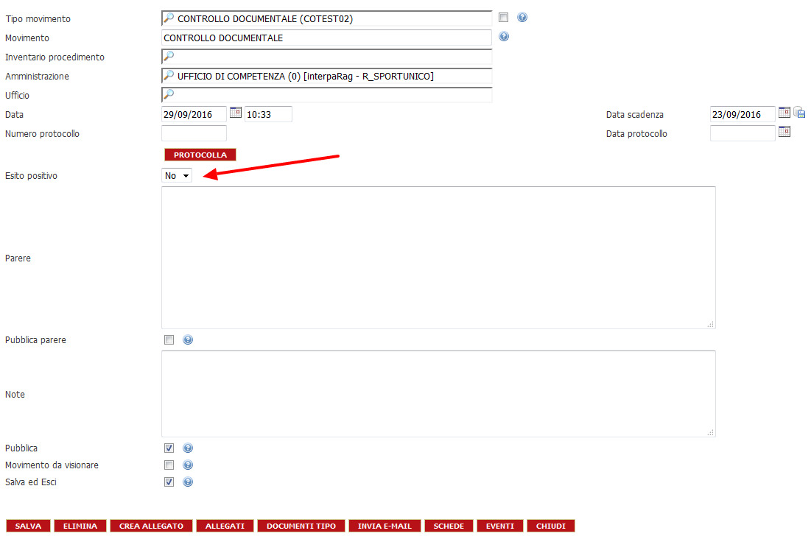
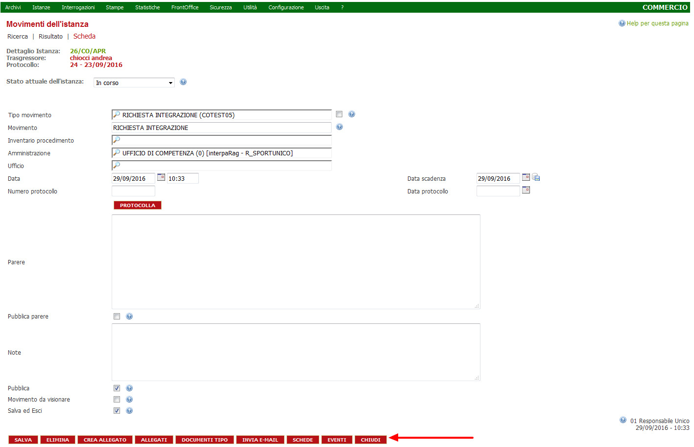

# Gestione di una pratica

Il flusso di informazioni e passi procedurali atti alla gestione di una pratica \(Istanza\), viene stabilito nel momento in cui un Comune decide di adottare questo sistema per la gestione delle proprie pratiche.In tale momento, vengono decisi gli attori \(ovvero gli uffici che gestiranno le informazioni\) le procedure e i tempi con cui queste ultime potranno essere gestite.

vediamo un esempio del funzionamento di un processo. A seguito dell’ incontro fra le figure citate, verrà stilato un diagramma di flusso, che, nel caso descritto è il seguente:

i passi, verranno codificati e all’ interno del programma, avranno questo aspetto:

nelle due aree cerchiate in rosso, si posso vedere i M**ovimenti** che sono stati eseguiti \(in verde\) e quelli ancora da eseguire \(in blu\).Si può aprire la pagina di dettaglio di uno specifico movimento, cliccando sul nome e premendo il tasto INSERISCI.

I paramentri sono tutti modificabili, ma E’ CONSIGLIATO NON MODIFICARLI poiché il loro cambiamento di stato, si rifletterà sul flusso della pratica. Nell immagine la freccia rossa, indica il campo che all’ interno del movimento \(in questo caso l’ esito del controllo documentale\) è soggetto al giudizio dell’ operatore \(quindi, abitualmente modificato da esso\).

## Gestione dei Movimenti

Viene ora illustrato come, all’ interno del movimento, possa essere percorsa la strada di default o variare i parametri e seguire un percorso diverso.

Verrà analizzato, all’ iterno del movimento CONTROLLO DOCUMENTALE \(come esempio sulla possibilità di cambiare il percorso predefinito di un movimento\) le possibilità offerte per la gestione di un documento. La freccia rossa \(figura sopra\) indica i pulsanti di cui parleremo in questo esempio.

Non ci soffermeremo sulla spiegazione di alcuni tasti di cui abbiamo già parlato \(SALVA ELIMINA CHIUDI...\),Ci concentreremo quindi sugli altri:

 il pulsante, permette l' apertura della scheda seguente

come mostrato dal messaggio, non sono presenti documenti allegati al movimento. Occorre quindi crearne uno. E' possibile farlo in due modi:

## Crea Documento

la scheda permette la selezione di un documento contenente dei campi  - precedentemente definiti - allegati al movimento in fase di preparazione della procedura. Se tali documenti non sono presenti è possibile \(spuntando i flag indicati dalla freccia 1 e 2\) tramite il carattere jolly immesso nel campo di ricerca \(%\) vedere la lista di tutti i documenti caricati nella libreria. 

E' bene ricordare che i documenti devono essere stati caricati nell' apposita libreria per poter essere usati all' interno del programma.

Una volta individuato il documento interessato, fra quelli  elencati,

vengono notificate le possibili azioni da compiere sullo stesso.

## Caricamento di un documento dal _movimento_

E' possibile compiere questa operazione, anche dal _movimento_ che stiamo analizzando, tramite la pressione del tasto

viene visualizzata la pagina che elenca gli allegati al movimento. Se non è presente l' allegato interessato, è possibile caricare un qualsiasi tipo di file.

tramite il tasto indicato in figura, si aprirà questa finestra:

infine, tramite il tasto indicato dalla freccia, verrà proposto questo pannello

che permetterà l' apertura della scheda, atta alla selezione di un file\(caratteristica del proprio sistema operativo\).

