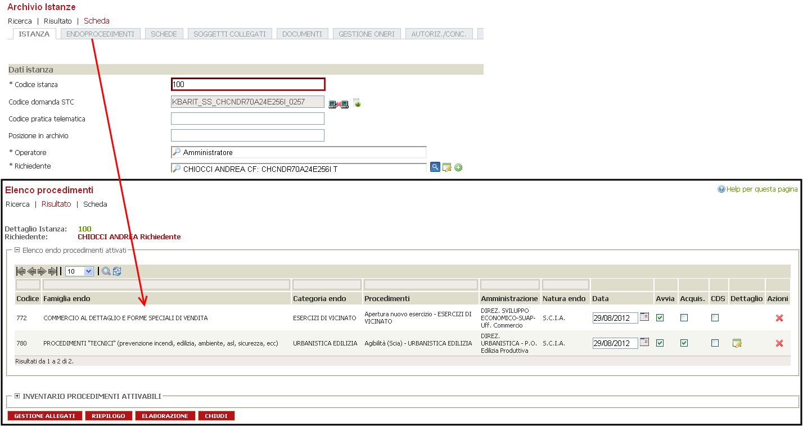
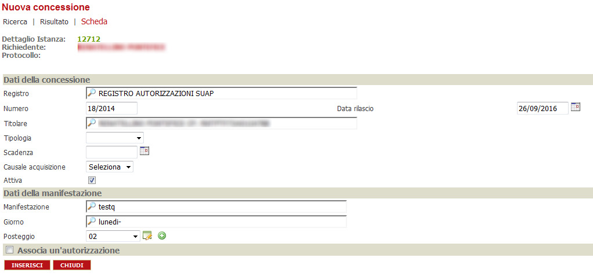
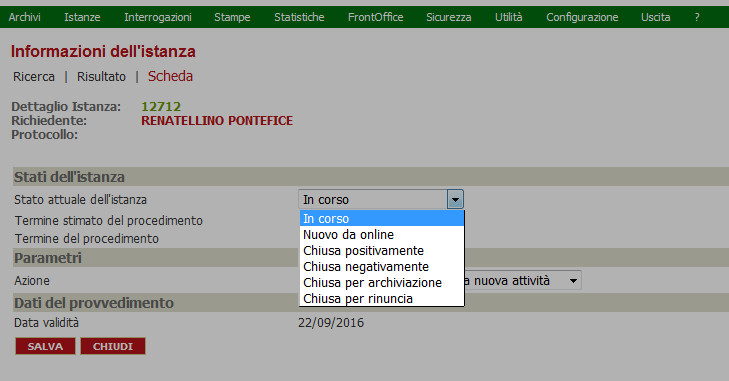

## Inserimento di una pratica {#inserimento-di-una-pratica}

La “**pratica**” é costituita, normalmente, dall’ insieme dei documenti inerenti una specifica operazione che un privato cittadino o soggetto giuridico compie al fine di “notificare” agli enti pubblici preposti \(e quindi ottenere il permesso di farlo\) tale operazione.

### Inserimento di una istanza {#inserimento-di-una-istanza}

L’ operazione, consente di creare quella che poi verrà chiamata **istanza.**_**\*\***_Questa, rappresenta la sintesi dell insieme di dati che comunemente é conosciuta dall’ impiegato comunale con il nome di pratica: ovvero tutti i dati necessari per l’espletamento delle operazioni atte a censire, autorizzare o meno una operazione che il cittadino intende compiere sulla proprietà privata o pubblica.

### Dati obbligatori {#dati-obbligatori}

Analiziamo una delle possibili vie per l’ inserimento di una **istanza**.

Come mostrato in figura, la voce per l’ inserimento, segue il seguente iter:istanze — modulo — Inserimento Rapido Istanzacon modulo si intende l’ area a cui l’ intervento è attinente. \(nell’ esempio:”commercio”.

Nella maschera dell **istanza**, sono presenti i dati che la identificano univocamente e quindi sono obbligatori. Il nome dei campi obbligatori, è caratterizzato dalla presenza di un asterisco \* accanto al nome \(come mostrato in figura\). Altri dato \(nella figura i campi DATA PRESENTAZIONE NUMERO DI PROTOCOLLO e relative data e ora\) possono risultare obbligatori se definiti tali in sede di configurazione. Per tale motivo, vengono bordati di rosso \(ma non hanno il simbolo dell’ asterisco\).

Nel caso in cui tali dati venissero omessi, il programma visualizzerà un errore e i campi obbligatori omessi verranno evidenziati con un contorno rosso.

#### Inserimento e modifica di una anagrafica {#inserimento-e-modifica-di-una-anagrafica}

Fra i primi e più importanti dati da immettere, vi è il RICHIEDENTE. Questo campo può essere popolato anche tramite la _ricerca referenziata._ Oppure, se l’ anagrafica non è già stata censita, è possibile inserirla tramite il tastoverde. Alla pressione del tasto, si aprirà la scheda per l’ immissione della anagrafica \(vedi figura\)

la scheda permette l’ immissione di numerose informazioni inerenti il soggetto censito

A seguito della selezione \(o immissione\) della anagrafica, si può procedere alla compilazione degli altri campi.

Analizziamo, al momento, solo i dati contrassegnati come obbligatori \(\*\).i dati riportati in figurahanno una particolarità \(oltre ad essere obbligatori\): vengono precompilati automaticamente, quando possibile. Nell’ esempio, il campo NUMERO ISTANZA viene calcolato automaticamente, aggiungendo 1 all’ ultimo numero istanza memorizzato. E’ possibile \(in sede di configurazione\) decidere se questo campo può essere modificato, calcolato automaticamente o meno.Il campo OPERATORE, viene compilato con il nome dell’ utente che ha acceduto il backoffice.

I campi rappresentati in figura, sono a loro volta obbligatori ma seguono un iter particolare:ovvero in sede di configurazione può essere deciso se:- la data è obbligatoria - la data è editabile- il numero di protocollo è obbligatorio ed editabile come la data. Inoltre, per il NUMERO PROTOCOLLO può essere configurato un software ad hoc per svolgere questo compito.

Gli ultimi campi obbligatori \(riportati in figura\) hanno a loro volta una particolarità: il campo INTERVENTO può essere selezionato da un albero \(che è stato opportunamente configurato in sede di configurazione\). Tale albero è visualizzabile premendo la lente \(blu\) indicata dalla freccia verde. Le cartelle contenute possono essere aperte cliccando il tasto +. le voci contenute nella cartella rappresentano gli interventi utilizzabili preconfigurati.Ogni INTERVENTO \(procedimento\) dispone di diverse procedure, elencate se all’ interno del medesimo campo \(PROCEDURE\) viene digitato il carattere %.

### I rimanenti campi
particolareggiano l’ intervento, ma non sono obbligatori.Il nome del campo fornisce intuitivamente il tipo di informazione necessaria {#irimanenti-campi-particolareggiano-l-intervento-ma-non-sono-obbligatori-il-nome-del-campo-fornisce-intuitivamente-il-tipo-di-informazione-necessaria}

### Dati disponibili dopo il primo salvataggio {#dati-disponibili-dopo-il-primo-salvataggio}

A seguito dell’ inserimento di una istanza, è possibile editarla nuovamente per poter rivederla o aggiungere informazioni.

#### Endoprocedimenti {#endoprocedimenti}

Selezionando la voce “Endoprocedimenti” Si aprirà l’elenco dei Endoprocedimenti attivati

Selezionando il + in “Inventario procedimenti attivabili”, verrà visualizzato l’elenco degli endoprocedimenti attivabili. Vengono attivati selezionando sulla check a destra “attiva” e cliccando “salva”.

selezionandolo si aprirà la pagina con tutti gli allegati dei procedimenti attivati.Rende disponibile l’elenco dei procedimenti con i dettagli. Rimanda alla pagina di “elaborazione” istanza.chiude la pagina e rimanda a quella precedentemente utilizzata.

#### Schede {#schede}

Schede aggiuntive per l’imputazioni di dati relativi a Interventi o Endoprocedimenti si trovano in questa sezione.

:Salva le modifiche apportate alle schede.:Ritorna alla pagina precedente.

#### Soggetti colegati {#soggetti-colegati}

Sono censiti in questa scheda i soggetti \(fisici o giuridici\) che non trovano posizione fra i campi principali della Istanza. Vengono selezionate dall’ archivio Anagrafe esistente per i vari soggetti.

All’ anagrafica selezionata potranno essere aggiunti documenti che ne comprovino l’ autenticità. Tramite il tasto \(indicato dalla freccia\) si aprirà una nuova maschera che permette tale operazione.

Il tasto copia soggetti collegati ha la funzione di incorporare \(fra i soggetti collegati\) le anagrafiche presenti all’ interno della medesima sezione \(Soggetti collegati\) della Istanza madre.

#### Documenti {#documenti}

In **ROSSO** è evidenziata la sezione che contiene gli allegati collegati all’intervento scelto e i pdf generati dopo la compilazione dalle schede dinamiche dell’istanza.Nella sezione evidenziata in **BLU** è presente l’eventuale procura.Per concludere in **VIOLA** è evidenziata la sezione che contiene gli allegati collegati agli endoprocedimenti.Per ciascun allegato l’icona  indica che si tratta di file firmati digitalmente: la selezione dell’icona stessa permette di visualizzare i dettagli della firma, verificandone la validità, e di scaricare il file nel formato originale \(ovvero senza estensione .p7m\) utilizzando il programma associato nel proprio pc.I pulsanti, per i quali è necessaria una spiegazione oltre a quelli già conosciuti, sono

* ”Allinea i Documenti”: controlla la coerenza fra i documenti inseriti nell’ Istanza e quelli indicati come obbligatori al momento della creazione della procedura.Per gli altri, il nome espone chiaramente la funzione assolta.

#### Gestione oneri {#gestione-oneri}

In questa scheda si trova la sintesi dei movimenti finanziari \(dovuti o ricevuti\) per l’ operazione descritta dalla Istanza.il tasto STAMPE permette la produzione di un file .rtf \(interamente configurabile\) da poter stampare.I campi a disposizione permettono il trattamento dell’ onere in maniera granulare.Ai già esistenti se ne possono aggiungere altri \(tasto NUOVO tramite la maschera sotto riportata\)

#### Autoriz.\/conc. {#autoriz-conc}

Tramite questa maschera, è possibile gestire i registri \(creati nella sezione apposita\). Per ogni voce è possibile annotarne vari campi \(come da immagini sottostanti\).Le due maschere, hanno campi simili, \(REGISTRO, NUMERO, SCADENZA ed altro\) l’ interpretazione èfacilmente desumibile dal contesto

#### Stampe {#stampe}

La sezione, permette di configurare stampe in risposta ad eventi generati dal sistema.

#### Istanze collegate {#istanze-collegate}

Alcune istanze possono essere collegate per fini pratici. Quest’ area permette il collegamento.

#### Altre funzioni {#altre-funzioni}

Selezionando la scheda, viene aperto il seguente pannellotramite il tasto INFO è possibile avere informazioni sulla Istanza e, ad esempio, \(come da immagine\), il termine stimato, variarne lo stato;quindi salvare le modifiche.

