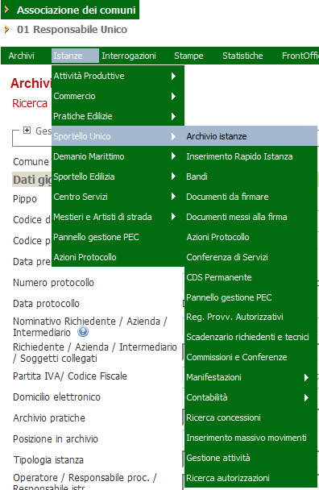
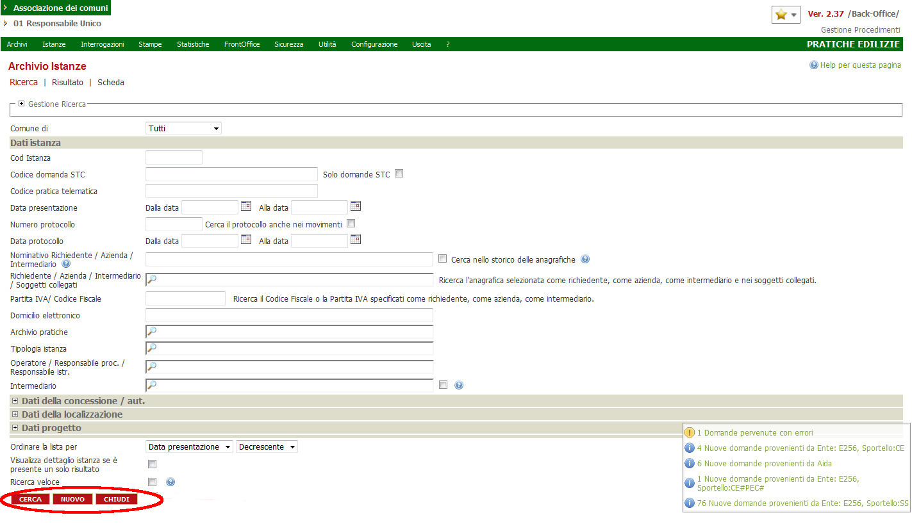
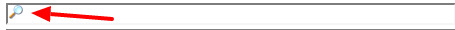

# Ricerca di una pratica

Tramite la voce di menu Istanze — modulo – Archivio istanze, è possibile accedere la pagina di ricerca delle Istanze. Da questa pagina, è possibile fare la ricerca di tutti i dati memorizzati nelle tabelle del DB. Come sempre, i campi che hanno l’ icona lente,

sono _Campi di input referenziati._

